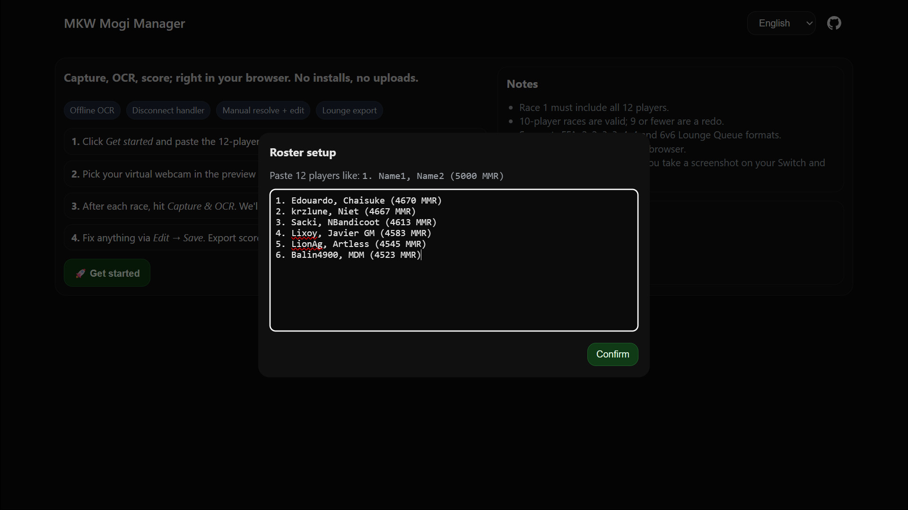
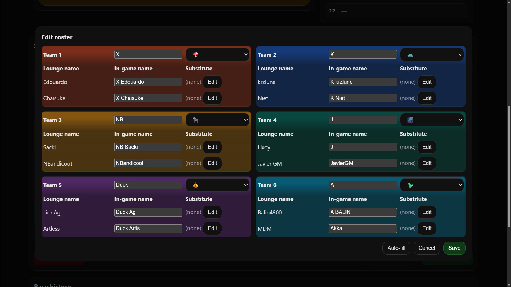
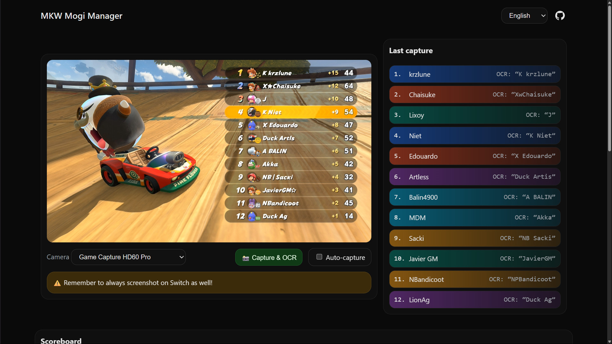
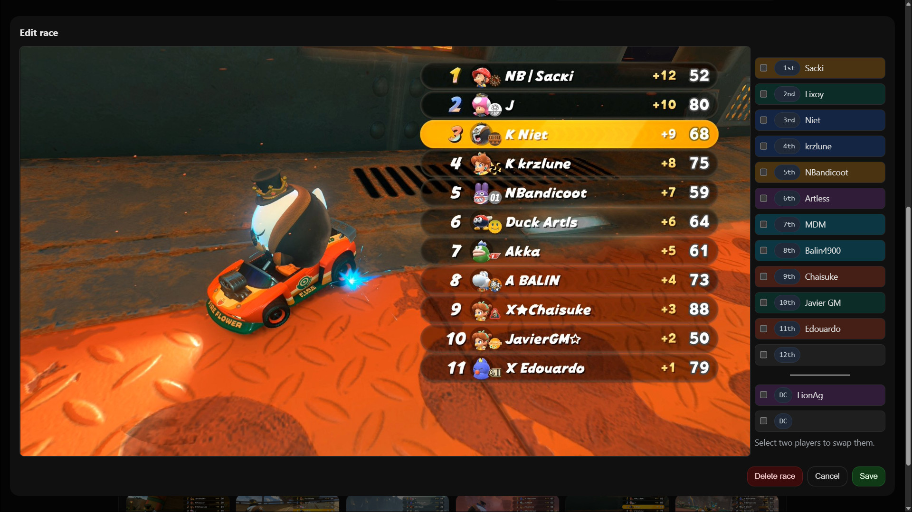
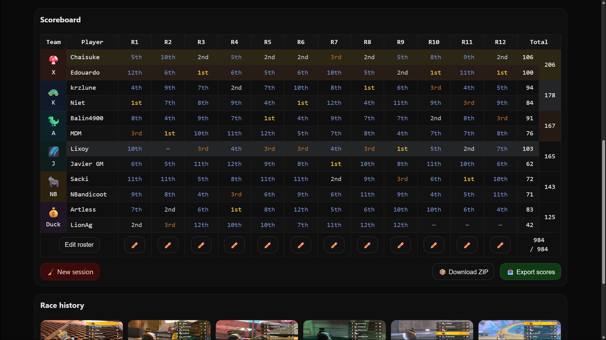
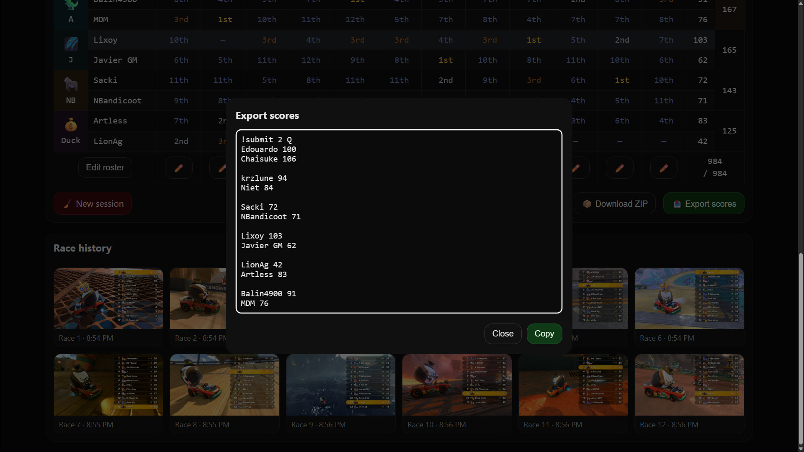

# MKW Mogi Manager

## Overview

**MKW Mogi Manager** is a tool to simplify tracking scores during competitive **Mario Kart World Lounge mogis**. Instead of manually writing down results, the app captures screenshots of the scoreboard, reads the names and scores, and keeps track of everything automatically. At the end of the session, you can export results in the format needed for **Lounge Discord bots**, along with a full package of screenshots and race data for reference.

👉 Live site: [https://pfqniet.github.io/mkw-lounge-tracker/](https://pfqniet.github.io/mkw-lounge-tracker/)

## Quick Start

1. **Open the app** (see link above).
2. **Paste participants list** from Lounge bot into the app.
3. **Select video device** (your OBS virtual webcam).
4. *(Optional)* Use **Pause Menu → Auto-fill** to set names.
5. After each race, on the **results screen**:

   * **Click Capture**, or
   * Use **Auto-Capture** (when you take a Switch screenshot).
6. **Check results** and fix any names/scores if needed.
7. After **12 races**, **Finish Session** → export to Discord or download ZIP.

For detailed instructions, see below.

## Key Features

* **Automatic Score Tracking** – Capture the scoreboard and let the app fill in scores for you.
* **Supports All Formats** – Free-for-all, 2v2, 3v3, 4v4, and 6v6.
* **Session Management** – Keeps track of all 12 races in a standard mogi.
* **Auto-Capture** – Optionally, the app can capture results automatically whenever you take a screenshot on your Switch.
* **Easy Fixes** – If the app makes a mistake, you can quickly correct names or scores before moving on.
* **Export Options** – Generate results for posting in Lounge, and download a ZIP with all data and screenshots.
* **Multiple Languages** – Available in English, French, German, and Japanese.

## What You Need

* A computer with a **capture card** connected to your console.
* A **web browser** (latest Chrome, Firefox, or Safari recommended).
* **OBS** or similar software to output your gameplay as a virtual webcam.

## How to Use

### Start a Session

1. **Copy and paste** the **participants list** provided by the Lounge bot into the app (e.g. `1. Name1, Name2 (12345 MMR)` for a 2v2 format).

2. **Select** your video capture device (the virtual webcam from OBS).

3. *(Optional)* Use the **Pause Menu** in-game and click **Auto-fill** to let the app learn player names ahead of time.

### After Each Race

1. When the **race results screen** is shown *(before it transitions to the overall session rankings)*, trigger a capture:

   * **Click** **Capture** in the app, **or**
   * Use **Auto-Capture** (if enabled), which listens for when you take a Switch screenshot and captures automatically.
2. The app will **read the names and scores** from the results screen.

3. **Check the results**:

   * ✅ If everything looks good, continue.
   * ❌ If something is wrong, **click to edit** the player name or score.

### Finishing Up

1. After **12 races**, verify your results.

2. Choose how you want to export:

   * **Discord Export** – Copy the formatted scores to post in Lounge.
   * **Full Export** – Download a ZIP with results, a summary, and all screenshots.

## Fixing Problems

Sometimes the app might not read everything perfectly. Here's what you can do:

* **No names detected** – Make sure you're on the results or pause screen and try again.
* **Wrong name or score** – Click to edit it before moving on.
* **Missing players** – Add them in manually if needed.

## Limitations

* The app may struggle if players have **very similar in-game names**, or even **identical names in team formats**. It will do its best to match them correctly, but you may need to step in and fix these manually.
* OCR accuracy depends on **video quality**. Lower brightness or sharpness may make results harder to read.

## Tips

* Always **capture from the race results screen**, not the session rankings.
* Use the **pause menu at the start** for smoother auto-filling of names during the session.
* **Team formats** are detected automatically from the participants list.
* You don't need to upload anything online. Everything runs **locally in your browser**.

---

That's it! **MKW Mogi Manager** is designed to save you time and effort so you can focus on racing. If something goes wrong, you always have the chance to fix it before results are final.

## Contributing & Feedback

This is an **open-source project**. If you'd like to contribute, report bugs, or suggest new features, please visit:

🔗 [**MKW Mogi Manager on GitHub**](https://github.com/PFQNiet/mkw-lounge-tracker)

Bug reports and feedback are always welcome through **GitHub issues**.
