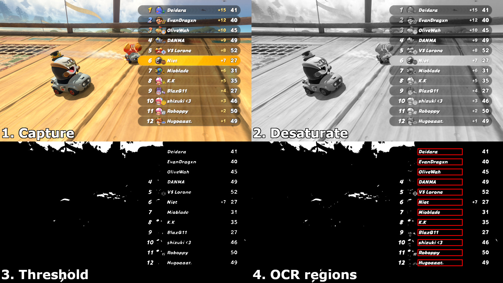

# MKW Results Tracker (Browser-based OCR)

A single-file web app to OCR Mario Kart results from a virtual webcam feed and keep scores.

**Live site:** https://pfqniet.github.io/mkw-lounge-tracker/

## Usage
1. Paste the 12-player roster (`1. Name (12345 MMR)`) when prompted.
2. Select your capture device (virtual webcam).
3. Click **Capture & OCR** after each race.
4. Use **Edit** under a race column to fix placements or mark DCs.
5. **Export scores** to copy the lounge-bot format.

## Contributing
PRs welcome! Please keep the app buildless (plain ESM).

### Notes
- Requires camera permission (browser will prompt).
- All camera usage is locally processed on your device.
- Works best in Chrome/Edge/Firefox; iOS Safari supported with `playsinline`.
- OCR uses tesseract.js via CDN; no server, no build step.

- "Auto-capture" feature in BETA: automatically detects when you take a screenshot on your Switch to trigger a capture.
